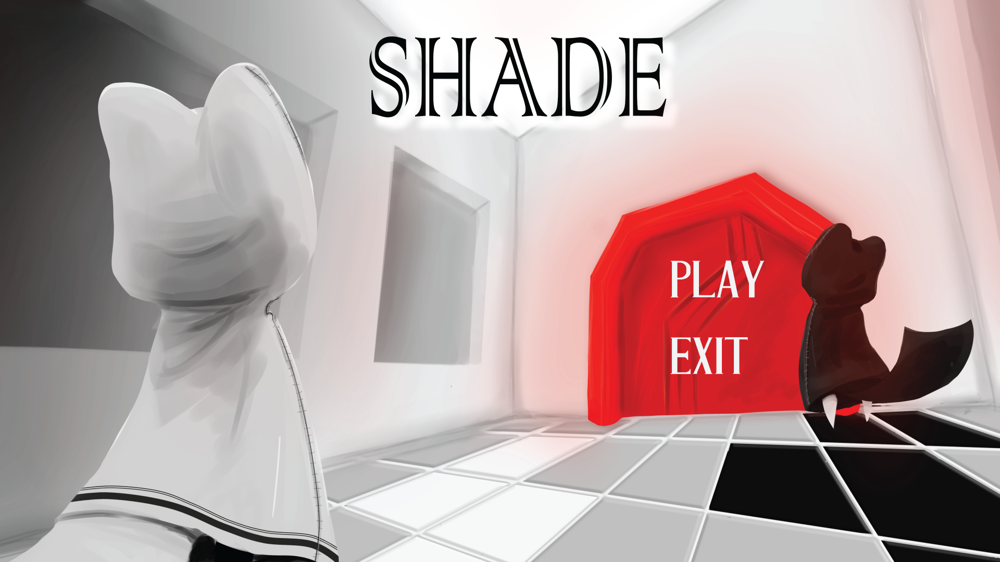

# Shade

Pixel Challenge 2017

##Description

Shade is a 2-players Coop-puzzle game developed by Silly Hat during the Pixel Challenge 2017.

##Concept

You have to reach the end of each level by painting a path which can be taken by your friend, your unique ability being to paint tiles in your friend's color 
(that is, black if you're the white player and vice-versa). Thus, each player has to help eachother moving in the different areas !
As you go further in the game you may stumble on different obstacles or have to trigger mechanisms that requires a bit of synchronization and quickness !

##Screenshots

##Authors
* Charles-William GUAY
* Patrick GOSSELIN
* Daphnée CHAREST-CHARRON
* Yannis M'RAD